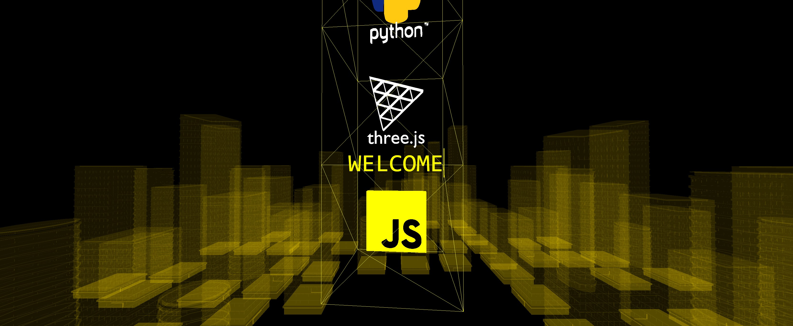
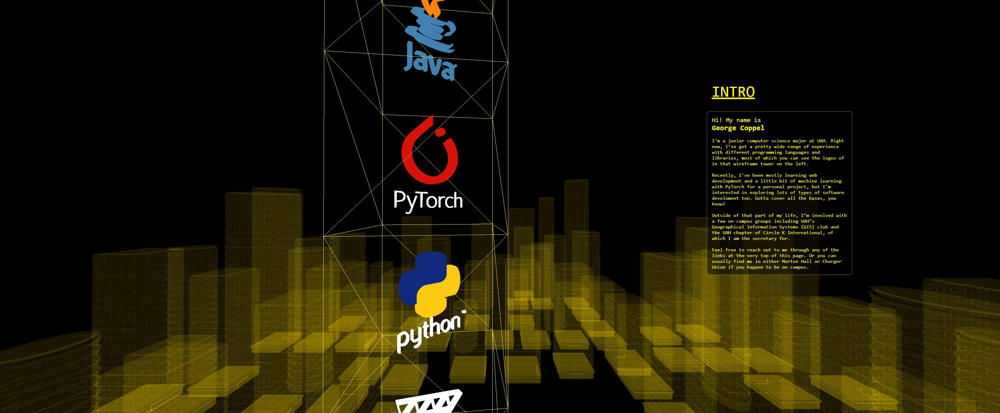
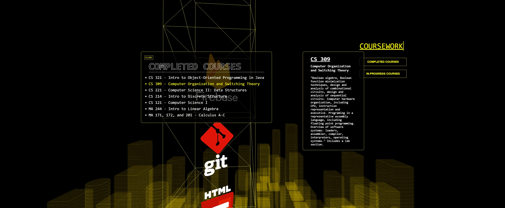

# georgecoppel.com

Code and assets used for www.georgecoppel.com available to view. 

Uses the three.js framework and lots of gltf files created in the Blender 3D modelling software. Hosted through Firebase. 

Assets can be found in the "static" folder and viewed at https://gltf-viewer.donmccurdy.com/ if you wanted to do that outside of the website for some reason. 

